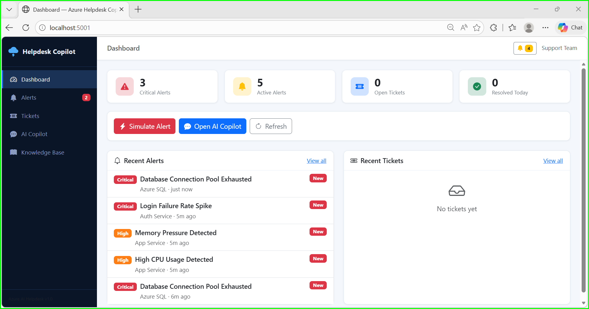
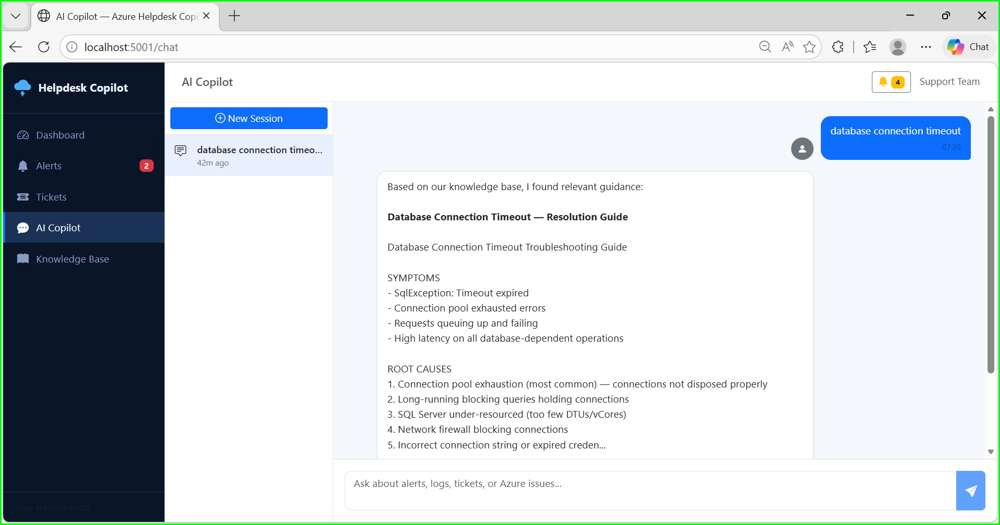
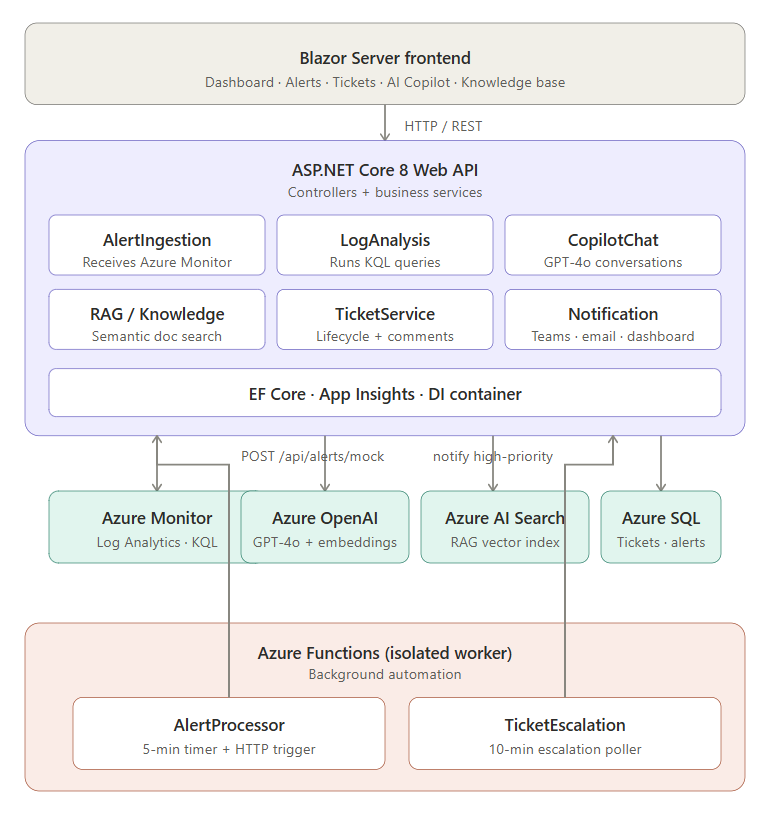

# 🛠️ Helpdesk Copilot

An AI-powered cloud support assistant for IT support teams. Automatically ingests Azure Monitor alerts, analyzes logs with KQL, searches a troubleshooting knowledge base using RAG, and creates incident tickets — all with AI-generated summaries and plain-English recommendations.

 



---

## ✨ Features

| | Feature | Description |
|---|---------|-------------|
| 🔔 | **Alert Ingestion** | Receives Azure Monitor alerts via REST API with a 7-type mock simulator for demos |
| 🤖 | **AI Alert Analysis** | One-click GPT-4o analysis — explains what happened, what to check, and next steps |
| 📋 | **KQL Log Analysis** | Runs pre-built KQL queries per alert type; falls back to realistic mock data |
| 📚 | **RAG Knowledge Base** | 6 built-in troubleshooting runbooks, semantic search via Azure AI Search |
| 💬 | **AI Copilot Chat** | Context-aware chat with session history, cited sources, and suggested actions |
| 🎫 | **Auto Ticket Creation** | One-click ticket from alert with AI summary, root cause, and recommended actions |
| 🔔 | **Notifications** | Dashboard alerts + mock Teams/email routing by severity |
| ⚡ | **Azure Functions** | Background alert poller (5 min) and ticket escalation notifier (10 min) |
| 🖥️ | **Blazor Dashboard** | Dashboard, Alerts, Tickets, AI Chat, and Knowledge Base pages |
| 🚀 | **IaC** | Bicep one-command deployment |

---

## 🏗️ Architecture



---

## 🧰 Tech Stack

| Area | Technology |
|------|-----------|
| Backend API | C# / ASP.NET Core 8 Web API |
| Frontend | Blazor Server (.NET 8) |
| AI / LLM | Azure OpenAI (GPT-4o) |
| RAG Search | Azure AI Search + in-memory fallback |
| Monitoring | Azure Monitor Query SDK |
| Telemetry | Application Insights |
| Automation | Azure Functions v4 (isolated worker) |
| Database | EF Core InMemory (dev) / Azure SQL (prod) |
| IaC | Bicep |
| CI/CD | GitHub Actions |

---

## 📋 Prerequisites

- [.NET 8 SDK](https://dotnet.microsoft.com/download)
- Visual Studio 2022 
- Azure OpenAI resource with GPT-4o deployment
- Azure AI Search resource
- Azure Monitor Log Analytics workspace

---

## ⚡ Quick Start

```bash
# Clone the repository
git clone <repo-url>
cd helpdesk-copilot

# Terminal 1 — Start the API (port 5000)
cd src/HelpdeskCopilot.Api
dotnet run

# Terminal 2 — Start the Web app (port 5001)
cd src/HelpdeskCopilot.Web
dotnet run
```

Open http://localhost:5001 in your browser.

The Swagger UI is available at http://localhost:5000/swagger.

---

## ⚙️ Configuring Azure Services

Edit `src/HelpdeskCopilot.Api/appsettings.json` (or use environment variables / Azure App Settings):

```json
{
  "AzureOpenAI": {
    "Endpoint": "https://your-resource.openai.azure.com/",
    "ApiKey": "your-api-key",
    "DeploymentName": "gpt-4o",
    "EmbeddingDeploymentName": "text-embedding-3-small"
  },
  "AzureSearch": {
    "Endpoint": "https://your-search.search.windows.net",
    "ApiKey": "your-search-key",
    "IndexName": "helpdesk-knowledge"
  },
  "LogAnalytics": {
    "WorkspaceId": "your-workspace-guid"
  }
}
```
---

## 📦 Modules

### 1. Alert Ingestion
- `POST /api/alerts` — ingest real alerts from Azure Monitor action groups
- `POST /api/alerts/mock` — simulate any of 7 alert types for demos
- `POST /api/alerts/{id}/analyze` — trigger AI analysis of an alert

### 2. Log Analysis
- `GET /api/logs/analyze/{alertId}` — run contextual KQL for an alert
- `POST /api/logs/query` — execute arbitrary KQL
- Falls back to realistic mock data when Log Analytics is not configured

### 3. RAG Troubleshooting Assistant
- 6 pre-loaded knowledge articles (App Service errors, SQL timeouts, CPU, Functions, Memory, Security)
- `POST /api/knowledge/search` — semantic search
- Uses Azure AI Search if configured, otherwise in-memory full-text search
- Knowledge base is automatically seeded on startup

### 4. AI Copilot Chat
- `POST /api/chat/message` — send a message, get an AI response with cited sources
- Full session history maintained per conversation
- Context-aware: passes alert details and relevant knowledge docs to GPT-4o
- Works without Azure OpenAI using intelligent rule-based fallback

### 5. Ticket Management
- Auto-creates tickets from alerts with AI-generated summaries, root cause, and recommended actions
- Full CRUD: status updates, priority, assignment, comments
- `POST /api/alerts/{id}/create-ticket` — one-click ticket from alert

### 6. Notifications
- Dashboard notifications for all new alerts and tickets
- Mock Teams and email notifications logged to console
- `GET /api/notifications?unreadOnly=true`

---

## 🔌 API Reference

| Method | Path | Description |
|--------|------|-------------|
| GET | /api/alerts | List alerts (filter by status) |
| POST | /api/alerts | Ingest alert |
| POST | /api/alerts/{id}/analyze | AI analysis |
| POST | /api/alerts/{id}/create-ticket | Auto-create ticket |
| GET | /api/alerts/{id}/logs | Log analysis |
| GET | /api/tickets | List tickets |
| POST | /api/tickets | Create ticket |
| PUT | /api/tickets/{id} | Update ticket |
| POST | /api/tickets/{id}/comments | Add comment |
| POST | /api/chat/message | Chat with AI |
| POST | /api/chat/sessions | New chat session |
| GET | /api/knowledge | All knowledge docs |
| POST | /api/knowledge/search | Search knowledge base |
| GET | /api/notifications | Get notifications |
| GET | /health | Health check |

Full interactive docs: http://localhost:5000/swagger

---

## ☁️ Deploying to Azure

### 1. Deploy Infrastructure

```bash
az group create --name rg-helpdesk-prod --location eastus

az deployment group create \
  --resource-group rg-helpdesk-prod \
  --template-file infrastructure/main.bicep \
  --parameters environment=prod sqlAdminPassword=<secure-password>
```

### 2. GitHub Actions (CI/CD)

Set these secrets in your GitHub repository:

| Secret | Value |
|--------|-------|
| `AZURE_CREDENTIALS` | Service principal JSON (`az ad sp create-for-rbac`) |
| `AZURE_SUBSCRIPTION_ID` | Your subscription ID |
| `RESOURCE_GROUP` | `rg-helpdesk-prod` |
| `API_APP_NAME` | `helpdesk-api-prod` |
| `WEB_APP_NAME` | `helpdesk-web-prod` |
| `SQL_ADMIN_PASSWORD` | Secure SQL password |

Push to `main` to trigger full deployment.

---

## 📁 Project Structure

```
├── src/
│   ├── HelpdeskCopilot.Api/        # ASP.NET Core Web API
│   │   ├── Controllers/            # REST endpoints
│   │   ├── Services/               # Business logic + Azure SDK
│   │   ├── Models/                 # Domain models
│   │   └── Data/                   # EF Core DbContext
│   ├── HelpdeskCopilot.Web/        # Blazor Server frontend
│   │   ├── Pages/                  # Dashboard, Alerts, Tickets, Chat
│   │   ├── Shared/                 # MainLayout, NavMenu
│   │   └── Services/               # ApiClient wrapper
│   └── HelpdeskCopilot.Functions/  # Azure Functions (background)
│       ├── AlertProcessorFunction  # 5-min alert poller
│       └── TicketNotifierFunction  # 10-min escalation checker
├── infrastructure/
│   ├── main.bicep                  # Root deployment
│   └── modules/                   # App Service, OpenAI, Search, SQL
├── docs/
│   └── troubleshooting/           # RAG knowledge base source docs
└── .github/workflows/ci-cd.yml    # Build, test, deploy pipeline
```

---

## 🎯 Example Scenario

1. Click on the Dashboard → selects a random alert type
2. On the Alerts page, click **AI Analyze** → GPT-4o (or rule-based) analysis appears inline
3. Click **Create Ticket** → ticket auto-populated with AI summary, root cause, recommended actions
4. Open **AI Copilot** → context-aware chat with cited knowledge base articles
5. In Tickets, add comments, update status, and resolve
